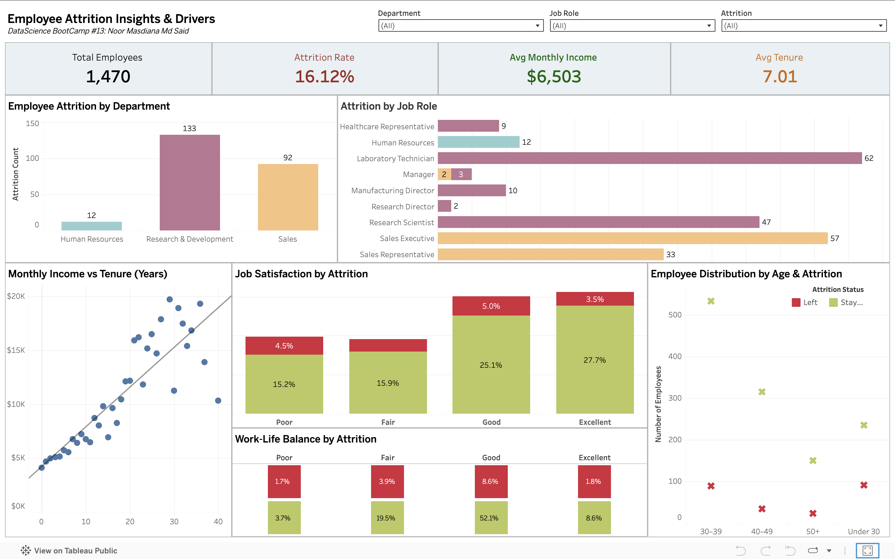

# 📊 **Data Science Capstone Project: Employee Attrition Analysis & Customer Sentiment Analysis**

## 📌 **Project Overview**

This capstone project was completed as part of a **Data Science Bootcamp** and demonstrates **end-to-end data analytics** and **machine learning workflows** using **Python**, **Natural Language Processing (NLP)**, and **Tableau**.

The project addresses two real-world business problems:

- **Employee Attrition Analysis** — understanding workforce turnover drivers

- **Customer Sentiment Analysis** — extracting insights from hospitality reviews

The objective is to translate data into **actionable, business-focused insights**.


## ⭐ **Why This Project Matters**

- **Solves real business problems**: Examines employee retention and customer satisfaction, critical factors affecting cost, service quality, and business performance

- **End-to-end data skills**: Includes EDA, visualization, statistical analysis, NLP, machine learning, and dashboard development

- **Actionable insights**: Identifies high-impact factors like work-life balance, job satisfaction, and service feedback, with clear business recommendations


## 🧩 **Project Structure**

The project is divided into three main sections:

- **Section A: Employee Attrition Analysis (Python: EDA & Visualization)**

- **Section B: Interactive Dashboard (Tableau)**

- **Section C: Customer Sentiment Analysis & Machine Learning (Python: NLP & ANN )**


## 🗂️ **Datasets Used**

1️⃣ **Employee Dataset**

- **File**: employee_dataset.csv

- Contains employee demographics, job information, income, tenure, satisfaction levels, and attrition status.

- Key features: Age, MonthlyIncome, YearsAtCompany, JobRole, Department, JobLevel, JobSatisfaction, WorkLifeBalance, Attrition


2️⃣ **Customer Reviews Dataset**

- **File**: Reviews.xlsx

- Contains hospitality service reviews: Review text, ratings, dates, hotel, and location metadata


## 🔍 **Section A: Employee Attrition Analysis (Python)**

📓 *Notebook: Section_A_Employee_Attrition_Analysis.ipynb*

**Analysis Workflow**

1. Dataset overview & data quality checks

2. Descriptive statistics (age, income, tenure)

3. Monthly income distribution (Histogram + KDE)

4. Income comparison by **Job Level** and **Department** (Boxplots)

5. Income vs tenure relationship (Scatter plot)

6. Correlation analysis of numeric features


**Key Findings**

| **Area**              | **Insight**                                                |
| ----------------- | ------------------------------------------------------ |
| Income Range      | $1,009 – $19,999                                       |
| Distribution      | Right-skewed; most employees earn mid-range income     |
| Job Level         | Higher levels earn more, confirming career progression |
| Tenure vs Income  | Moderate positive correlation (0.51)                   |
| Attrition Drivers | Income alone does not explain attrition                |


**HR Insight**:

Employee attrition is driven primarily by **experience-related factors** (work-life balance, job satisfaction, role pressure), not salary alone.


**📝 Business Recommendations**

1. Improve work-life balance via flexible policies

2. Introduce role-specific retention strategies

3. Launch early-career mentorship programs

4. Track job satisfaction with regular surveys


## 📊 **Section B: Employee Attrition Dashboard (Tableau)**

🔗 **Interactive Tableau Dashboard**:



👉 [View Dashboard on Tableau Public](https://public.tableau.com/app/profile/noor.masdiana.md.said/viz/Capstone_Project_Tableau_17679042510940/Dashboard1)


**Executive Metrics**

- Total Employees: **1,470**

- Overall Attrition Rate: **16.1%**

- Average Tenure: **7.0 years**

- Average Monthly Income: **$6,503**

**Key Insights**

- **Sales** has the highest attrition rate

- **R&D** has the highest attrition count

- **Work-life balance** is the strongest predictor of retention

- Younger employees (<40) show higher mobility


## 🧠 **Section C: Customer Sentiment Analysis & Machine Learning (Python)**

*📓 Notebook: Section_C_Customer_Sentiment_Analysis.ipynb*

**Analysis Pipeline**

1. Text preprocessing (cleaning, tokenization, lemmatization)

2. Sentiment analysis using **VADER**

3. Text vectorisation using **Bag of Words (BoW)** and **TF-IDF**

4. Review rating prediction using **Artificial Neural Network (ANN)**


## 🔍 **Sentiment Analysis using VADER**

| **Sentiment** | **Number of Reviews** |
| --------- | ----------------- |
| Positive  | 8,313             |
| Negative  | 1,372             |
| Neutral   | 314               |


**Insights**

- The majority of customer reviews express **positive sentiment**, indicating **high overall customer satisfaction**

- Negative reviews, while fewer, represent a **significant and meaningful segment** that highlights areas requiring improvement

- Neutral reviews are minimal, suggesting customers tend to express **clear opinions** rather than mixed or ambiguous feedback


## 🔤 **Text Feature Engineering: BoW vs TF-IDF**

To prepare text data for machine learning, two vectorisation techniques were evaluated:

**Bag of Words (BoW)**

- Counts word frequency across documents

- Treats all words equally

- Simple but sensitive to very common terms

**TF-IDF (Term Frequency–Inverse Document Frequency)**

- Weighs words by **importance**, not just frequency

- Downweights common words appearing across many reviews

- Highlights **discriminative terms** linked to sentiment


**Why TF-IDF Was Preferred**

| **Aspect**                       | **BoW**    | **TF-IDF** |
| ---------------------------- | ------ | ------ |
| Handles common words         | ❌      | ✅      |
| Highlights sentiment drivers | ❌      | ✅      |
| ML-ready features            | ⚠️     | ✅      |
| Interpretability             | Medium | High   |


**TF-IDF Insights**:

- **Positive drivers**: room, clean, staff, breakfast, location

- **Negative drivers**: bad, bed, noise, night, check

- Overlapping terms (room, staff, good) indicate **inconsistent service quality**


**📌 Conclusion**:

TF-IDF provided superior feature representation and was used as input for the ANN model.


## 🤖 **Review Rating Prediction Using Artificial Neural Network (ANN)**

**Target Classes**

| **Class** | **Meaning**  | **Count** |
| ----- | -------- | ----- |
| 2     | Positive | 7,660 |
| 1     | Neutral  | 1,186 |
| 0     | Negative | 1,153 |

📌 Dataset is **imbalanced**, dominated by positive reviews.

**Model Performance**

- **Overall Accuracy: 79%**

| **Class**    | **F1-Score** |
| -------- | -------- |
| Negative | 0.58     |
| Neutral  | 0.27     |
| Positive | 0.89     |

**Observation**:

- Strong performance on positive reviews

- Neutral reviews hardest to predict due to overlapping language


## 🔄 **VADER vs ANN: Comparative Insights**

| **Aspect**                | **VADER**                | **ANN**                         |
| --------------------- | -------------------- | --------------------------- |
| Speed                 | Very fast            | Moderate                    |
| Interpretability      | High                 | Medium                      |
| Predictive capability | ❌                    | ✅                           |
| Best use case         | Monitoring sentiment | Automated rating prediction |


🔑 **Top Service Keywords**

| **Positive**                                             | **Negative**                            |
| ---------------------------------------------------- | ----------------------------------- |
| room, hotel, stay, staff, clean, breakfast, location | room, bad, bed, noise, night, check |


**📝 Business Recommendations (Customer Sentiment)**

1. **Room & Bed Comfort**
   - Inspect rooms with frequent complaints.
   - Upgrade bedding or fix maintenance issues in problem rooms.

2. **Check-in/Check-out Process**
   - Streamline check-in procedures to reduce negative mentions.
   - Provide staff training to improve guest experience during arrival/departure.

3. **Noise Management**
   - Investigate "night" complaints: noisy neighbours, thin walls, or external disturbances.
   - Consider soundproofing or quieter room allocations.

4. **Staff Training & Support**
   - Staff praised overall, but negative mentions show room for improvement in handling specific issues.
   - Ensure consistency in service quality across shifts.

5. **Monitor Mixed Feedback**
   - Words like "good" appear in both positive and negative, indicating inconsistent guest experiences.
   - Implement feedback follow-ups to understand why expectations are sometimes not met.


## 💼 **Business Value Delivered**

- Identifies **key drivers of employee attrition**

- Extracts **actionable customer insights** from unstructured text

- Demonstrates **ML-ready NLP pipelines**

- Supports **data-driven HR and service improvement strategies**


## 🛠️ **Tools & Libraries**

- **Python**: Pandas, NumPy, Matplotlib, Seaborn, Scikit-learn, NLTK

- **NLP**: VADER, Bag of Words, TF-IDF

- **Machine Learning**: Artificial Neural Network

- **Visualization**: Tableau Public


## 📌 **Key Skills Demonstrated**

- Exploratory Data Analysis (EDA)

- Data Visualization & Dashboard Design

- Text Feature Engineering (BoW, TF-IDF)

- Sentiment Analysis & NLP

- Machine Learning Model Development

- Business-focused Data Storytelling


## ✅ Final Takeaway

This project demonstrates **full-stack data science capability** — from structured workforce analytics to unstructured text modeling — supported by clear business interpretation and practical, data-driven recommendations.

It is designed to be **immediately understandable to recruiters, hiring managers, and business stakeholders**.


## 🚀 How to Run

```bash
pip install -r requirements.txt
jupyter notebook


